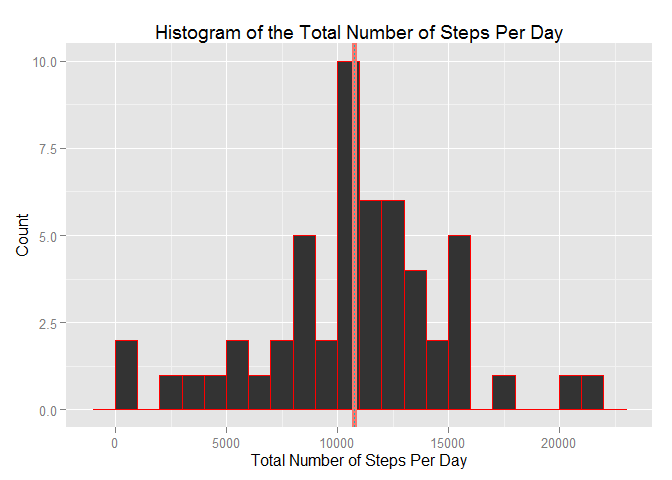
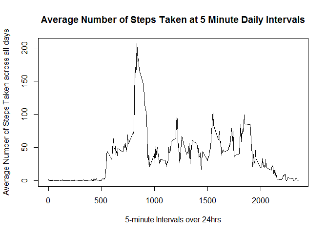
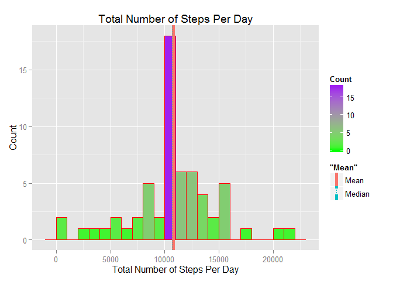
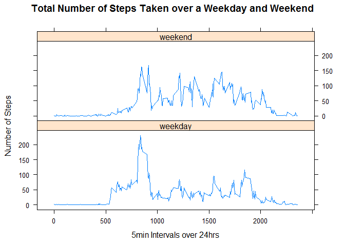

# Reproducible Research: Peer Assessment 1
## Loading Packages

```r
library(knitr)
library(dplyr)
```

```
## 
## Attaching package: 'dplyr'
## 
## The following object is masked from 'package:stats':
## 
##     filter
## 
## The following objects are masked from 'package:base':
## 
##     intersect, setdiff, setequal, union
```

```r
library(ggplot2)
```

```
## Warning: package 'ggplot2' was built under R version 3.1.3
```

```r
library(lattice)
```


## Loading and preprocessing the data

```r
fit_dataset <- tbl_df(read.csv(unz("activity.zip", "activity.csv")))
str(fit_dataset)
```

```
## Classes 'tbl_df', 'tbl' and 'data.frame':	17568 obs. of  3 variables:
##  $ steps   : int  NA NA NA NA NA NA NA NA NA NA ...
##  $ date    : Factor w/ 61 levels "2012-10-01","2012-10-02",..: 1 1 1 1 1 1 1 1 1 1 ...
##  $ interval: int  0 5 10 15 20 25 30 35 40 45 ...
```


## What is mean total number of steps taken per day?
1. **Calculate the total number of steps per day**

```r
fit_na_omit<-na.omit(fit_dataset)
by_date<-group_by(fit_na_omit,date)
output_dataset<-summarize(by_date,totalSteps=sum(steps))
print(output_dataset)
```

```
## Source: local data frame [53 x 2]
## 
##          date totalSteps
## 1  2012-10-02        126
## 2  2012-10-03      11352
## 3  2012-10-04      12116
## 4  2012-10-05      13294
## 5  2012-10-06      15420
## 6  2012-10-07      11015
## 7  2012-10-09      12811
## 8  2012-10-10       9900
## 9  2012-10-11      10304
## 10 2012-10-12      17382
## ..        ...        ...
```
2. **Make a histogram of the total number of steps taken each day**

```r
        ggplot(data=output_dataset, aes(output_dataset$totalSteps)) + 
        geom_histogram( binwidth=1000,
                       col="red") +
        labs(title="Histogram of the Total Number of Steps Per Day") +
        labs(x= "Total Number of Steps Per Day", y= "Count") +
        ## Draw line for mean
        geom_vline(aes(xintercept = mean(output_dataset$totalSteps), color="Mean",linetype = "Mean"), size=2) +
        ## Draw line for median
        geom_vline(aes(xintercept = median(output_dataset$totalSteps),color="Median",linetype = "Median"))  
```

 

3. **Calculate and report the mean and median of the total number of steps taken per day**


```r
# Mean
meanNARemoved<-mean(output_dataset$totalSteps)
print(meanNARemoved)
```

```
## [1] 10766.19
```

```r
# Median
medianNARemoved<-median(output_dataset$totalSteps)
print(medianNARemoved)
```

```
## [1] 10765
```

## What is the average daily activity pattern?

1. **Make a time series plot (i.e. type = "l") of the 5-minute interval (x-axis) and the average number of steps taken, averaged across all days (y-axis)**


```r
        time_dataset <- summarise(group_by(fit_na_omit, interval),
                                  meanSteps=mean(steps))
        ## Plot the data
        plot(time_dataset$interval,time_dataset$meanSteps, type="l",
             main="Average Number of Steps Taken at 5 Minute Daily Intervals",
             xlab="5-minute Intervals over 24hrs", 
             ylab="Average Number of Steps Taken across all days")
```

 

2. **Which 5-minute interval, on average across all the days in the dataset, contains the maximum number of steps**


```r
        max5min_dataset <- time_dataset[which(time_dataset$meanSteps == 
                                    max(time_dataset$meanSteps)),]
        max5min_dataset$interval
```

```
## [1] 835
```

## Imputing missing values  

1. **Calculate and report the total number of missing values in the dataset (i.e. the total number of rows with NAs)**  

```r
    length(which(is.na(fit_dataset)))
```

```
## [1] 2304
```
2.**Devise a strategy for filling in all of the missing values in the dataset. The strategy does not need to be sophisticated. For example, you could use the mean/median for that day, or the mean for that 5-minute interval, etc.**

* Iterate over the 'fit_dataset' to find for the steps with value as NA (function)
* If steps=NA, get the interval value for that row
* Get the mean steps for that interval(You can use time_dataset above)
* Set the mising NA to steps=meanSteps  


3.**Create a new dataset that is equal to the original dataset but with the missing data filled in.**


```r
        missingNAsf <- function(fit_dataset, time_dataset) {
                if (is.na(fit_dataset["steps"])) 
                    {  ## Get 'mean' for current '5 min' interval
                      rs <- time_dataset[which(time_dataset$interval ==
                                fit_dataset[["interval"]]),c(FALSE, TRUE)]
                        ## Replace 'NA' with 'steps = meanStep
                        fit_dataset[["steps"]] <- as.integer(round(
                            rs$meanSteps))
                }
                fit_dataset
        }
        ## Iterate over the dataframe and return dataset where 'NA's' have been replaced with mean for that 5 minute interval
        newFit_ds <- by(fit_dataset, 1:nrow(fit_dataset), missingNAsf, time_dataset)
        newFit_ds <- do.call(rbind, newFit_ds)
print(newFit_ds)
```

```
## Source: local data frame [17,568 x 3]
## 
##    steps       date interval
## 1      2 2012-10-01        0
## 2      0 2012-10-01        5
## 3      0 2012-10-01       10
## 4      0 2012-10-01       15
## 5      0 2012-10-01       20
## 6      2 2012-10-01       25
## 7      1 2012-10-01       30
## 8      1 2012-10-01       35
## 9      0 2012-10-01       40
## 10     1 2012-10-01       45
## ..   ...        ...      ...
```

4.1 **Make a histogram of the total number of steps taken each day**


```r
        naStepsPerDay_DS <- summarise(group_by(newFit_ds, date), 
                                    total=sum(steps))

        ggplot(data=naStepsPerDay_DS, aes(naStepsPerDay_DS$total)) + 
        geom_histogram(binwidth=1000, col="red", aes(fill=..count..)) +
        scale_fill_gradient("Count", low = "green", high = "purple") +
        labs(title="Total Number of Steps Per Day") +
        labs(x= "Total Number of Steps Per Day", y= "Count") +
        ## Draw line for mean
        geom_vline(aes(xintercept = mean(naStepsPerDay_DS$total), 
                       color="Mean", linetype = "Mean"), 
                   size=2, show_guide = TRUE) +
        ## Draw line for median
        geom_vline(aes(xintercept = median(naStepsPerDay_DS$total), 
                       color="Median", linetype = "Median"), show_guide = TRUE)
```

 

4.2. **Calculate and report the mean total number of steps taken per day?**


```r
        meanNASet <- mean(naStepsPerDay_DS$total)
        print(meanNASet)
```

```
## [1] 10765.64
```

4.3. **Calculate and report the median total number of steps taken per day?**
 

```r
        medianNASet <- median(naStepsPerDay_DS$total)
        print(medianNASet)
```

```
## [1] 10762
```

4.4.** Do these values differ from the estimates from the first part of the assignment?**

- First 'Mean' estimate was **10766.19** and this estimate is **10765.64**. 
- First 'Median' estimate was **10765.00** and this estimate is **10762.00**.

So the difference is very small.

4.5. **What is the impact of imputing missing data on the estimates of the total daily number of steps?**  

No real impact.


## Are there differences in activity patterns between weekdays and weekends?

1.**Create a new factor variable in the dataset with two levels - "weekday" and "weekend" indicating whether a given date is a weekday or weekend day.**


```r
        ## Convert 'date' factor variable to type date
        dates <- as.Date(newFit_ds$date, format = "%Y-%m-%d")
        days <- weekdays(dates) ## Get day of week
        ## Is date a weekend day
        isWeekend <- days %in% c("Saturday", "Sunday")
        ## Convert to factor
        weekdayOrWeekend <- factor(isWeekend)
        ## False implies it's a "weekday"
        levels(weekdayOrWeekend)[1] <- "weekday"
        ## True implies it's a "weekend day"
        levels(weekdayOrWeekend)[2] <- "weekend"
        ## Create new dataset where 'NA's' are set to 5min interval mean and
        ## a new column that tells you if the 'date' is 'weekday' or 'weekend' 
        weekdayOrWeekend_dataset<- cbind(newFit_ds, weekdayOrWeekend)
        str(weekdayOrWeekend_dataset)
```

```
## 'data.frame':	17568 obs. of  4 variables:
##  $ steps           : int  2 0 0 0 0 2 1 1 0 1 ...
##  $ date            : Factor w/ 61 levels "2012-10-01","2012-10-02",..: 1 1 1 1 1 1 1 1 1 1 ...
##  $ interval        : int  0 5 10 15 20 25 30 35 40 45 ...
##  $ weekdayOrWeekend: Factor w/ 2 levels "weekday","weekend": 1 1 1 1 1 1 1 1 1 1 ...
```

2.**Make a panel plot containing a time series plot (i.e. type = "l") of the 5-minute interval (x-axis) and the average number of steps taken, averaged across all weekday days or weekend days (y-axis). See the README file in the GitHub repository to see an example of what this plot should look like using simulated data?**


```r
        plot_DS <- weekdayOrWeekend_dataset %>%
                   group_by(weekdayOrWeekend, interval) %>%
                   summarise(avg=mean(steps))
        xyplot(avg ~ interval | weekdayOrWeekend, data = plot_DS, 
               layout = c(1, 2), type = "l", xlab="5min Intervals over 24hrs", 
               ylab="Number of Steps", 
               main="Total Number of Steps Taken over a Weekday and Weekend")
```

 
